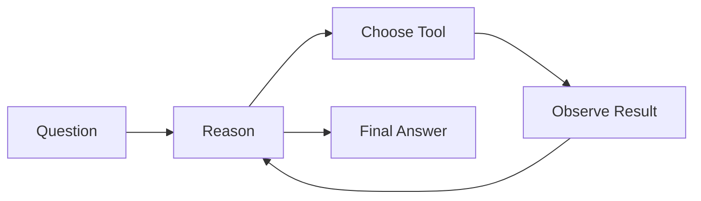

# 🚀 LangChain & Agentic AI Learning Repository

<p align="center">


</p>

<p align="center">
  <b>Hands-on implementation of LangChain concepts, Chains, Structured Outputs, and ReAct Agents using local LLMs with Ollama.</b>
</p>

---

## 📖 Overview

This repository showcases my practical learning journey in **Generative AI**, **LLM Engineering**, and **Agentic AI Systems** using the LangChain ecosystem.

The projects progress from foundational concepts such as local LLM integration and message handling to advanced implementations including custom chains, workflow orchestration, and database-powered AI agents.

---

## ⚡ Highlights

<table>
<tr>
<td width="50%">

### 🧠 LLM Engineering

* Local LLM Integration
* Ollama + Mistral
* Prompt Engineering
* Structured Outputs

</td>
<td width="50%">

### 🤖 Agentic AI

* ReAct Agents
* Tool Usage
* Database Agents
* Autonomous Reasoning

</td>
</tr>
</table>

---

## 🏗️ Repository Structure

```text
LangChain-Learning
│
├── 📂 Topic-1
│   ├── 📓 LLM_Call_Using_Ollama.ipynb
│   ├── 📓 LangChain_Messages.ipynb
│   └── 📓 Structured_Output.ipynb
│
├── 📂 Topic-2
│   ├── 📓 1_Basic_chaining.ipynb
│   ├── 📓 2_Chain_with_custom_runnable.ipynb
│   ├── 📓 3_Parallel_chains.ipynb
│   └── 📓 4_conditional_chains.ipynb
│
├── 📂 Topic-3
│   ├── 📓 1_ReAct_Agent_Intro.ipynb
│   ├── 📓 2_React_DB_Agent.ipynb
│   │
│   └── 📂 SalesDB
│       └── 🗄️ sales.db
│
└── 📄 README.md
```

---

# 🎯 Topic 1 — LangChain Fundamentals

### 🖥️ LLM Call Using Ollama

Learn how to run a local Large Language Model using **Ollama + Mistral** and interact with it through LangChain.

#### Concepts Covered

* Offline LLM Execution
* LangChain Model Integration
* Prompt Invocation
* Local AI Workflows

---

### 💬 LangChain Messages

Understanding conversational building blocks used by chat models.

#### Concepts Covered

* SystemMessage
* HumanMessage
* AIMessage
* Multi-turn Conversations
* Chat History Management

---

### 📋 Structured Output

Generate reliable, schema-driven responses from LLMs.

#### Concepts Covered

* Pydantic Models
* Output Parsing
* JSON Generation
* Validation Pipelines

---

# 🔄 Topic 2 — Chains

Building intelligent workflows by combining multiple LLM operations.

| Notebook                               | Description                     |
| -------------------------------------- | ------------------------------- |
| **1_Basic_chaining.ipynb**             | Sequential execution of prompts |
| **2_Chain_with_custom_runnable.ipynb** | Custom Runnable implementation  |
| **3_Parallel_chains.ipynb**            | Concurrent workflow execution   |
| **4_conditional_chains.ipynb**         | Dynamic routing and branching   |

### Skills Gained

* LCEL Fundamentals
* Workflow Composition
* Reusable Components
* Dynamic Execution Logic

---

# 🤖 Topic 3 — AI Agents

Implementing autonomous systems capable of reasoning and interacting with external resources.

---

## 🧠 ReAct Agent Introduction

Implementation of the **Reason + Act** framework.

### Concepts Covered



* Tool Selection
* Iterative Reasoning
* Observation Handling
* Autonomous Decision Making

---

## 🗄️ ReAct Database Agent

Using AI agents to query structured data through natural language.

### Features

✔ Natural Language to SQL

✔ Database Query Execution

✔ Business Data Retrieval

✔ Analytical Question Answering

---

### Database Asset

```text
SalesDB/
└── sales.db
```

SQLite database used for agent-driven querying demonstrations.

---

# 🛠️ Technical Skills Demonstrated

<table>
<tr>
<td>

### AI & LLMs

* LangChain
* Ollama
* Mistral
* Prompt Engineering

</td>
<td>

### Agent Systems

* ReAct Agents
* Tool Calling
* Decision Loops
* Agent Workflows

</td>
<td>

### Data

* SQLite
* SQL
* Structured Outputs
* Data Analysis

</td>
</tr>
</table>

---

# 📈 Learning Roadmap

### Completed ✅

* Local LLM Integration
* Message Handling
* Structured Outputs
* Chains
* Custom Runnables
* ReAct Agents
* Database Agents

### Next Steps 🚀

* Retrieval-Augmented Generation (RAG)
* Vector Databases (FAISS/Chroma)
* Multi-Agent Systems
* Memory Management
* LangGraph
* Production Deployments

---

# 👨‍💻 Author

**Vikash**

AI Enthusiast focused on:

```text
Generative AI
│
├── LLM Engineering
├── Agentic AI
├── Workflow Automation
├── AI Applications
└── Open-Source AI Ecosystem
```

---

<p align="center">
⭐ If you found this repository useful, consider starring it.
</p>
